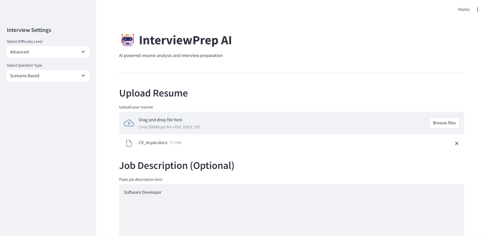
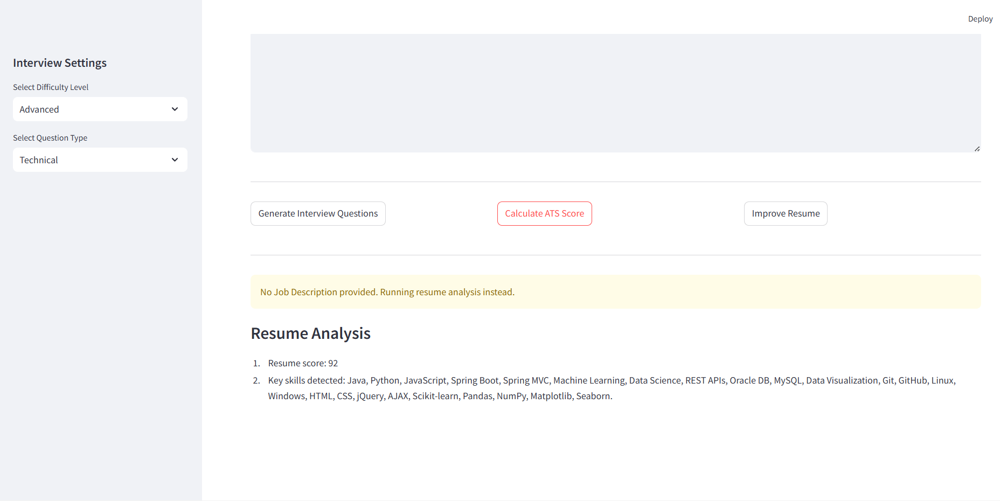
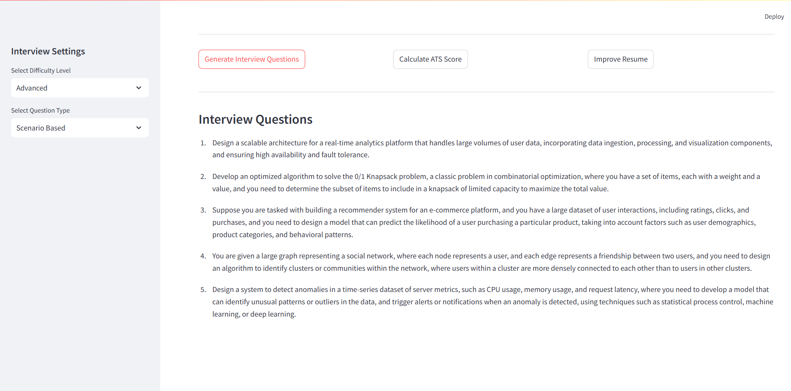
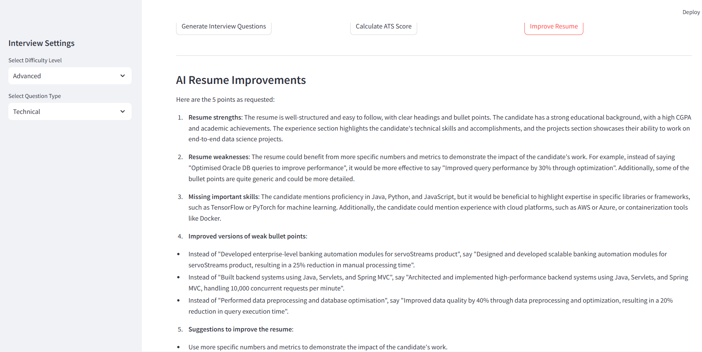

# 🚀 Interview Prep AI (RAG-based Resume Analyzer)

An AI-powered application that analyzes resumes and generates personalized interview questions using **Retrieval-Augmented Generation (RAG)**. It also calculates ATS scores based on job descriptions and provides actionable resume improvement suggestions.

---

## 🔥 Features

- 📄 **Resume Upload UI** – Upload and process resumes easily  
- 🧠 **Generate Interview Questions** – AI-based questions from resume  
- 🎯 **Difficulty Levels**
  - Beginner  
  - Intermediate  
  - Advanced  
- 📊 **ATS Score Calculation** – Match resume with job description  
- ✨ **Resume Improvement Suggestions** – Enhance resume quality  
- 💬 **Interactive UI** – Built using Streamlit  

---

## 🏗️ Tech Stack

- **Language:** Python 3.8.10  
- **LLM API:** Groq  
- **Frontend:** Streamlit  
- **Concepts:**  
  - Retrieval-Augmented Generation (RAG)  
  - Natural Language Processing (NLP)  
  - Semantic Search  

---

## 📂 Project Structure

interview-prep-ai/
│
├── app/
│ ├── chains/ # LLM chains
│ ├── parsers/ # Resume parsing
│ ├── rag/ # Embeddings & retrieval
│ ├── services/ # ATS + improvements
│
├── ui/
│ └── streamlit_app.py
│
├── screenshots/
│ ├── upload-ui.png
│ ├── ats-score.png
│ ├── questions.png
│ └── improvement.png
│
├── requirements.txt
├── README.md
├── .gitignore
└── .env.example

---

## ⚙️ Setup Instructions

### 1. Clone the repository

git clone https://github.com/aryan-prasad22/interview-prep-ai-through-cv.git  
cd interview-prep-ai-through-cv  

---

### 2. Create virtual environment

python -m venv venv  

---

### 3. Activate environment

Windows:  
venv\Scripts\activate  

Mac/Linux:  
source venv/bin/activate  

---

### 4. Install dependencies

pip install -r requirements.txt  

---

### 5. Add API Key

Create a `.env` file in root directory:

GROQ_API_KEY=your_api_key_here  

---

### ▶️ Run the application

streamlit run ui/streamlit_app.py  

---

## 📸 Screenshots

### 📄 Resume Upload UI

### 📊 ATS Score Calculation

### 🧠 Generated Interview Questions

### ✨ Resume Improvement Suggestions

---

## 🧠 How It Works

1. Resume is uploaded and parsed  
2. Text is cleaned and chunked  
3. Embeddings are generated for semantic understanding  
4. Relevant content is retrieved using RAG  
5. LLM generates:
   - Interview questions  
   - ATS score  
   - Resume improvement suggestions  

---

## 🚀 Example Workflow

- Upload your resume  
- Enter job description  
- Select difficulty level  
- Get:
  - Personalized interview questions  
  - ATS score  
  - Resume improvement feedback  

---

## 🔒 Security Note

- API keys are stored in `.env`  
- `.env` is excluded via `.gitignore`  
- Never expose API keys publicly  

---

## 📌 Future Improvements

- Add PDF/DOCX parsing improvements  
- Enhance ATS scoring using ML models  
- Deploy using Streamlit Cloud / Docker  
- Add user authentication  
- Store user history  

---

## 💼 Resume / CV Description

- Built a RAG-based AI system to analyze resumes and generate personalized interview questions  
- Implemented ATS scoring by matching resumes with job descriptions using semantic search  
- Developed modular backend services for resume parsing, scoring, and improvement suggestions  
- Designed an interactive Streamlit UI for real-time feedback and analysis  

---

## 📄 License

MIT License